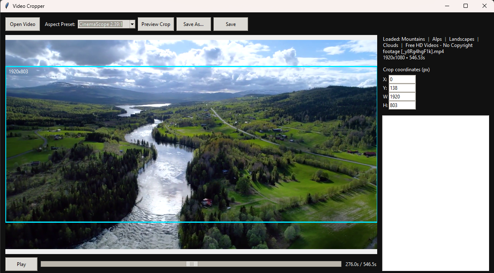

# Video Cropper

A lightweight Tkinter desktop tool for Windows that makes it easy to crop common video formats with ffmpeg. The UI borrows familiar ideas from CapCut: open a video, pick a cinematic or social-friendly aspect preset (Reels, TikTok, YouTube, CinemaScope, square), drag the crop box, preview, and export.




## Features

- Supports common formats: `.mp4`, `.m4v`, `.mov`, `.mpg`, `.mpeg`, `.3gp`.
- Drag-to-select crop box with optional aspect presets (CinemaScope 2.39:1, YouTube 16:9, Instagram Reels/TikTok 9:16, Square 1:1, Freeform).
- Smooth timeline preview powered by python-vlc snapshots.
- ffmpeg-powered export that copies audio streams and uses the crop filter for reliable, hardware-independent results.

## Requirements

- Python 3.10+
- ffmpeg and ffprobe available on your PATH (install the static Windows builds or use a package manager like `choco install ffmpeg`).
- [VLC media player](https://www.videolan.org/vlc/) installed so `python-vlc` can drive playback and snapshots.
- Pillow (installed automatically via `pip`).

## Setup

1. Install [ffmpeg](https://ffmpeg.org/download.html) and ensure both `ffmpeg` and `ffprobe` are on your `PATH`.
   - Windows: install the static build or run `choco install ffmpeg`.
   - macOS: `brew install ffmpeg`.
   - Verify with `ffmpeg -version` and `ffprobe -version` after installation.
2. Create and activate a virtual environment:

   ```bash
   python -m venv .venv
   source .venv/bin/activate  # Windows: .venv\Scripts\activate
   ```

3. Upgrade packaging tools so editable installs work even on older pip versions:

   ```bash
   python -m pip install --upgrade pip setuptools wheel
   ```

4. Install the app in editable mode (pulls in Pillow automatically). If you still
   see a message about editable mode requiring setuptools, upgrade pip to the
   latest release:

   ```bash
   pip install -e .
   ```

## Usage

You can launch the UI either via the module entry point or the installed script:

```bash
python -m video_cropper
# or, after installation
video-cropper
```

1. Click **Open Video** and pick a file.
2. Select an **Aspect Preset** (or leave as Freeform) to lock the crop box.
3. Drag on the preview to set the crop box. You can also type coordinates in the sidebar.
4. Click **Preview Crop** to refresh the preview with the crop applied.
5. Click **Export Video** to render and save. The export runs in the background so the UI stays responsive.

## Notes

- Export runs in a background thread and streams ffmpeg logs to the sidebar so the UI stays responsive.
- The preview uses a single cropped frame for speed; the export runs the full crop filter on the entire video.
